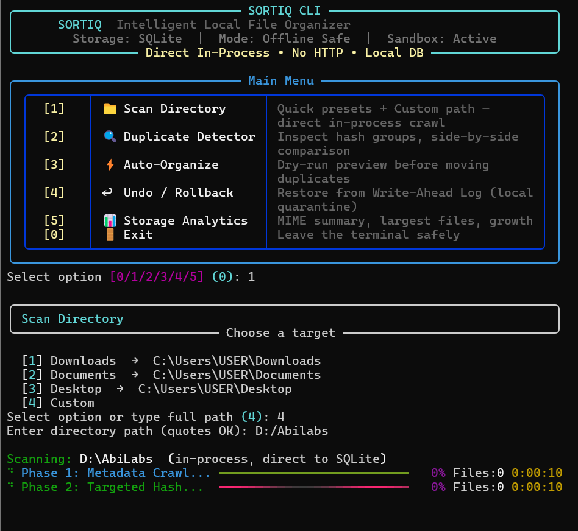

<div align="center">

# ⚡ Sortiq

**Intelligent, Offline-Safe Desktop File Management & Deduplication**

<p>
  
  
  
  
  
</p>

<p>
  <code>Python 3.12</code> &bull; <code>React 19</code> &bull; <code>TypeScript</code> &bull; <code>Tailwind CSS</code> &bull; <code>Rich TUI</code>
</p>

<br>

<p align="center">
  
</p>

</div>

---

Sortiq is a high-performance, offline-first desktop file management utility engineered for developers, data archivists, and anyone managing massive local storage. Unlike cloud-dependent organizers, Sortiq operates entirely within your machine: it crawls directories synchronously, catalogs metadata into a local SQLite database, detects structural duplicates using a targeted two-phase hash algorithm, and performs all destructive actions through the Windows Recycle Bin with automatic rollback support.

The project is designed around three core principles: **Safety** (system paths protected, non-destructive cleanup), **Speed** (ignore dev-bloat directories, compute hashes only when same-size candidates exist), and **Simplicity** (interactive terminal menus, zero server setup, standalone executable packaging).

---

## 🛡️ Security & Zero-Risk Architecture

*   **PathGuard Protection**: Hardcoded directory blacklists prevent any operation against critical Windows system paths (`C:\Windows`, `C:\Program Files`, `C:\ProgramData`, `C:\Windows\System32`, `C:\Users\All Users\AppData`). All paths are normalized, validated for traversal attacks (`..` escapes), and blocked if they fall into reserved system zones.
*   **Non-Destructive Operations**: Every file deletion is handled via `send2trash` (Windows Recycle Bin) rather than permanent `os.remove`. For cases where the Recycle Bin is unavailable, a local `.sortiq_quarantine` directory with unique naming serves as a safe fallback. No operation ever performs data destruction without an undo path.
*   **Write-Ahead Log (WAL) Rollback**: Every organizational action is journaled, allowing users to restore files to their original paths instantly with a 1-click rollback mechanism.
*   **Zero Telemetry**: The scanner communicates with no external APIs, no background HTTP services, and no telemetry endpoints. All data lives locally under `%LOCALAPPDATA%\Sortiq\`.

---

## ⚡ High-Speed Smart Engine

### Two-Phase Smart-Hashing
Instead of computing expensive SHA-256 hashes for every file discovered (which causes severe I/O bottlenecks on multi-terabyte drives), Sortiq implements a targeted, size-grouped approach:

1.  **Phase 1 — Metadata Crawl**: The scanner performs high-speed directory traversal, collecting `stat().st_size`, `st_mtime`, relative paths, extensions, and MIME metadata. It skips build artifacts (`node_modules`, `.git`, `.venv`, `dist`, `.next`, `.turbo`) and safely skips broken Windows directory junctions to prevent `[WinError 3]` spam.
2.  **Phase 2 — Targeted Hash**: Only files with identical non-zero sizes are selected for SHA-256 computation using `GROUP BY size HAVING COUNT(*) > 1`. This eliminates 99% of unnecessary hashing work when files are uniquely sized.

### Ignored Directory Set
The crawl automatically excludes:
`node_modules`, `.git`, `.venv`, `venv`, `__pycache__`, `dist`, `build`, `.next`, `.turbo`, `.cache`

---

## 📊 Component Overview

| Component | Technology | Responsibility |
| :--- | :--- | :--- |
| **Scanner Engine** | `sortiq_fs.walker`, pure Python | Directory crawl, symlink-safe traversal |
| **Hasher Engine** | `hashlib.sha256`, `sortiq_fs.hasher` | Partial + full SHA-256 on candidates only |
| **PathGuard** | `sortiq_fs.pathguard` | System folder protection, traversal validation |
| **Catalog DB** | SQLite (`%LOCALAPPDATA%\Sortiq\sortiq.db`) | Persistent file index with unique constraints |
| **CLI UI** | `rich` (Progress, Table, Panel) | Interactive menu, live progress, summary tables |
| **Desktop Shell** | `desktop.py`, PyInstaller | Standalone `.exe` without browser coupling |

---

## 🚀 Quick Start

### Prerequisites
*   Windows 10 or 11
*   Python 3.10+ (3.12 recommended)
*   `uv` or `pip`

### Installation
```bash
git clone https://github.com/Aby020/sortiq.git
cd sortiq
uv sync
```

### Running the Interactive CLI
```bash
uv run python sortiq_cli.py
```

Inside the interface, select option `[1] Scan Directory` to crawl a folder with automatic ignore rules and observe the real-time progress tracker followed by a clean summary table.

### Running the Desktop Application
```bash
uv run python desktop.py
```

### Building Standalone Executable
```bash
uv run pyinstaller sortiq.spec --noconfirm
```
The resulting `dist\Sortiq.exe` bundles the frontend assets and backend engine for portable, offline operation.

---

## 🖥️ Dual-Mode Interface

Sortiq is designed to be accessible through both terminal and desktop modes:

*   **Terminal Mode (`sortiq_cli.py`)**: A `rich`-powered interactive experience with branded header badges, arrow/numeric menu selection, live progress tracking (`Progress` with spinner and file counter), post-scan `Table` summaries, duplicate detector, and analytics dashboards.
*   **Desktop Mode (`desktop.py`)**: A packaged standalone window that embeds the web frontend (`frontend/`) and communicates directly with the backend SQLite layer, operating fully offline.

---

## 🛡️ Safety & Recovery Details

**PathGuard Policy Details**
The guard validates every path against these rules:
*   Block listed Windows system directories (`C:\Windows`, `Program Files`, `ProgramData`, `System32`, `AppData` roots).
*   Block reserved device names (`CON`, `PRN`, `AUX`, `NUL`, `COM1-9`, `LPT1-9`).
*   Reject UNC paths (`\\server\share`).
*   Block non-permitted drive letters outside the permitted set.
*   Prevent traversal outside the managed drive root (`is_within` check).

**Recovery Protocol**
*   All removals route to the Recycle Bin.
*   Quarantine fallback directory is maintained at `%LOCALAPPDATA%\Sortiq\.sortiq_quarantine`.
*   Rollback is supported via WAL and direct DB restoration.

---

## 📄 License
Distributed under the MIT License. See `LICENSE` for full terms.
